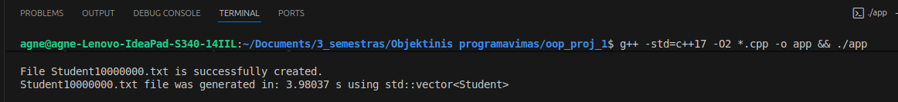
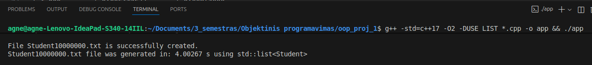
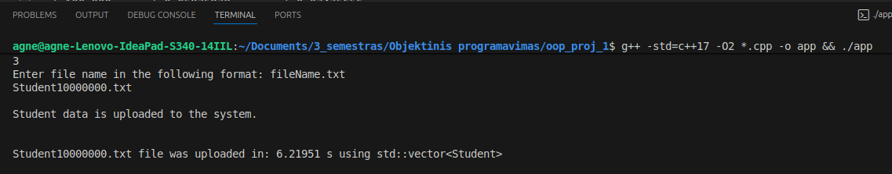
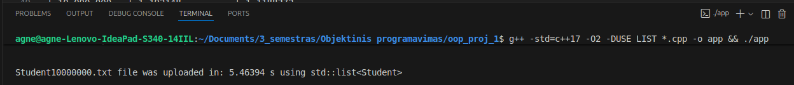
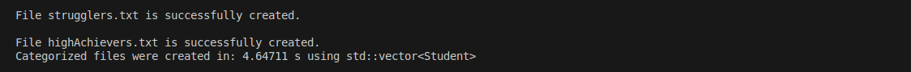
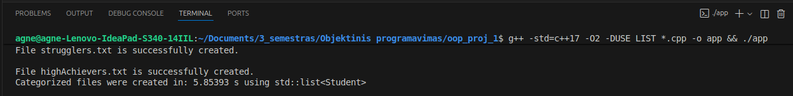

# oop_proj_1

# (v1.0)
Programoje studentų dalijimo į dvi kategorijas buvo naudojama funkcija, kuri atitinka 1 strategiją.
Todėl buvo sukurto dvi naujos funkcijos naudojant 2 ir 3 strategijas.

## Rezultatai

### VECTOR Studentų rūšiavimas į dvi kategorijas (vid.):
| Įrašų kiekis | 1 strategija (s) | 2 strategija (s) | 3 strategija (s) |
|--------------|------------------|------------------|------------------|
| 1 000        | 0.000249402      | 4.53356e-05      | 7.53746e-05  
| 10 000       | 0.00279157       | 0.000420785      | 0.000658982
| 100 000      | 0.01678          | 0.00316335       | 0.00590283
| 1 000 000    | 0.124591         | 0.0336813        | 0.05502
| 10 000 000   | 1.3581           | 0.370949         | 0.574973

### LIST Studentų rūšiavimas į dvi kategorijas (vid.):
| Įrašų kiekis | 1 strategija (s) | 2 strategija (s) | 3 strategija (s) |
|--------------|------------------|------------------|------------------|
| 1 000        | 0.000294958      | 0.000172689      | 0.000172689
| 10 000       | 0.002069002      | 0.000172689      | 0.000172689
| 100 000      | 0.01242656       | 0.000172689      | 0.000172689
| 1 000 000    | 0.1211802        | 0.000172689      | 0.000172689
| 10 000 000   | 1.192148         | 0.000172689      | 0.000172689

# (v0.3)
Šioje versijoje (`v0.3`) buvo atliktas testavimas, siekiant palyginti `std::vector` ir `std::list` veikimo spartą.
Testavimui naudoti tie patys duomenų failai kaip ir `v0.2` versijoje.  
Kiekvienam konteineriui buvo atliekami matavimai su tokiais įrašų kiekiais (1000, 10000, 100000, 1000000, 10000000 įrašų).

## Testavimo aplinka
| Parametras |  Reikšmė                    | 
|------------|-----------------------------|
| CPU        | Intel(R) Core(TM) i7-1065G7 |
| RAM        | 8 GB                        |
| Diskas     | SSD                         |
| OS         | Ubuntu 24.04.3 LTS          |

## Rezultatai

Atsitiksinių studentų sąrašų failų kūrimas (vid.):
| Įrašų kiekis | `std::vector` (s) | `std::list` (s) |
|--------------|-------------------|-----------------|
| 1 000        | 0.0017713         | 0.001936278
| 10 000       | 0.00814588        | 0.0110534
| 100 000      | 0.05982952        | 0.06057134
| 1 000 000    | 0.4506244         | 0.4379546
| 10 000 000   | 4.3473            | 4.343814

Duomenų nuskaitymas iš failų (vid.):
| Įrašų kiekis | `std::vector` (s) | `std::list` (s) |
|--------------|-------------------|-----------------|
| 1 000        | 0.002358702       | 0.001804468
| 10 000       | 0.01968436        | 0.01750358
| 100 000      | 0.08291886        | 0.078372
| 1 000 000    | 0.6835998         | 0.561991
| 10 000 000   | 6.60041           | 6.604486

Studentų rūšiavimas į dvi kategorijas (vid.):
| Įrašų kiekis | `std::vector` (s) | `std::list` (s) |
|--------------|-------------------|-----------------|
| 1 000        | 0.000294958       | 0.000172689
| 10 000       | 0.002069002       | 0.00192168
| 100 000      | 0.01242656        | 0.01240088
| 1 000 000    | 0.1211802         | 0.10524554
| 10 000 000   | 1.192148          | 1.1188372

Surūšiuotų studentų išvedimas į du naujus failus (vid.):
| Įrašų kiekis | `std::vector` (s) | `std::list` (s) |
|--------------|-------------------|-----------------|
| 1 000        | 0.002195244       | 0.00879666
| 10 000       | 0.0164007         | 0.01603442
| 100 000      | 0.05875878        | 0.07475656
| 1 000 000    | 0.5272746         | 0.6350894
| 10 000 000   | 4.934834          | 5.80888

# (v0.2)
Atlikus programos spartos testus su skirtingais duomenų failų dydžiais (1 tūkst., 10 tūkst., 100 tūkst., 1 mln. ir 10 mln. įrašų), nustatyta:
- Failų kūrimo laikas auga beveik tiesiškai priklausomai nuo įrašų kiekio.
- Duomenų nuskaitymas užtrunka ilgiau nei kūrimas, ypač su dideliais failais (pvz., 10 mln. įrašų nuskaitymas užtruko vidutiniškai 6,3 s).

| Įrašų kiekis | Atsitiksinių studentų sąrašų failų kūrimo vid. (s) |
|--------------|----------------------------------------------------|
| 1 000        | 0.003338122                                        |
| 10 000       | 0.010401078                                        |
| 100 000      | 0.05856702                                         |
| 1 000 000    | 0.4611562                                          |
| 10 000 000   | 4.250476                                           |

| Įrašų kiekis | Duomenų nuskaitymas iš failų vid. (s) |
|--------------|---------------------------------------|
| 1 000        | 0.002008618                           |
| 10 000       | 0.010693404                           |
| 100 000      | 0.0747804                             |
| 1 000 000    | 0.6019136                             |
| 10 000 000   | 6.308904                              |

| Įrašų kiekis | Studentų rūšiavimas į dvi kategorijas vid. (s) |
|--------------|------------------------------------------------|
| 1 000        | 0.000288262                                    |
| 10 000       | 0.001714236                                    |
| 100 000      | 0.01753584                                     |
| 1 000 000    | 0.1313298                                      |
| 10 000 000   | 1.46565                                        |

| Įrašų kiekis | Surūšiuotų studentų išvedimas į du naujus failus vid. (s) |
|--------------|-----------------------------------------------------------|
| 1 000        | 0.001948826                                               |
| 10 000       | 0.013065428                                               |
| 100 000      | 0.06703692                                                |
| 1 000 000    | 0.5017516                                                 |
| 10 000 000   | 4.878024                                                  |

# (v0.1)
Šiame release programa patobulinta taip, kad vartojas galetų nuskaityti studentų duomenis is txt failo.
Nuskaityti duomenys išvedami į tą pati lentelės pavidalą kaip ir v.pradine versijoje:

|Name    |Surname   |Final grade (mean)  |Final grade (median)  |
|--------|----------|--------------------|----------------------|
|Name1   |Surname1  |8.00                |8.00                  |
...

Studentų duomenys yra rušioujami pagal vardą.

Buvo sėkmingai atidaryti visi testavimo failai:
- studentai10000.txt
- studentai100000.txt 
- studentai1000000.txt

# (v.pradine)
Programa  priema studento vardą ir pavardę, namų darbų tarpinius rezultatus ir egzamino rezultatą, ir iš balų išveda galutinį balą.
Išvedama lentelė su studentų vardais ir galutiniu balu paskaičiuotu pagal varotojo pasirinkimą (Galutinis (Vid.) arba Galutinis (Med.) ar abudu). Galutiniais balais suskaičiuotais pagal formulę:
Galutinis = 0.4 * vidurkis + 0.6 * egzaminas
